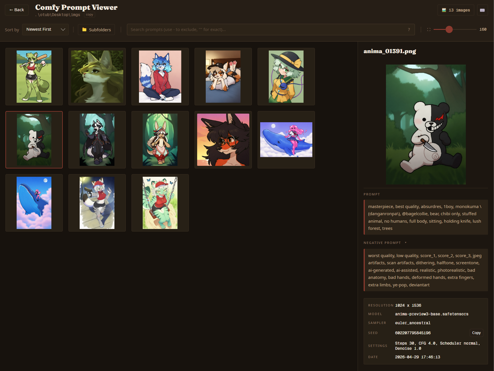

# ComfyPromptViewer

ComfyPromptViewer is a local desktop app for browsing AI image output folders and viewing the prompts and generation settings saved inside image files.

It supports images from ComfyUI, Forge Neo, Draw Things, and Stable Diffusion WebUI/A1111-style metadata.



## Features

- Browse large folders of generated images in a virtualized, adjustable-size grid, optionally including subfolders.
- View prompts, negative prompts, image dimensions, models, samplers, seeds, tool hints, LoRAs, extra resources, and common generation settings.
- Search filenames, positive prompts, negative prompts, or all metadata with exact phrases and exclusions.
- Copy positive and expanded negative prompts from dedicated sidebar buttons; very long positive prompts collapse behind a fade and can be expanded.
- Open a zoomable, pannable preview and move between images without closing it.
- Right-click gallery cards or the large preview to copy prompts, negative prompts, or image paths; open the file location; or delete the image.
- Sort by date or filename, switch color themes, and quickly reopen recent folders.
- Watch the active folder for created, modified, renamed, or removed images.
- Cache thumbnails and parsed metadata locally for faster repeat browsing.

## Search Syntax

- Separate terms with spaces, commas, or semicolons.
- Use `-term` or `-"exact phrase"` to exclude matches.
- Put a term in quotes for an exact word or phrase: `"red dress"`.
- Use the scope selector to search all metadata, positive prompts, negative prompts, or filenames only.

Examples:

```text
portrait cinematic -watermark
"red dress" -"blurry background"
```

## Keyboard and Mouse Controls

- Arrow keys, `Home`, and `End`: navigate the gallery or large preview.
- `Space`, `Enter`, or double-click: open the selected image preview.
- `Esc`, `Space`, or `Enter`: close the large preview.
- Mouse wheel: scroll the gallery; zoom the large preview.
- Drag in the large preview: pan a zoomed image.
- Middle-click in the gallery: start autoscroll.

## Getting Started

### Download a Release
Download the latest self-contained packaged build from the [GitHub Releases page](https://github.com/0tub/Comfy-Prompt-Viewer/releases). Packaged builds do not require a separate .NET installation.

### Run from Source

Prerequisite:

- [.NET 9 SDK](https://dotnet.microsoft.com/download/dotnet/9.0)

```powershell
dotnet run --project src\ComfyPromptViewer\ComfyPromptViewer.csproj
```

### Build Standalone Executables
- **Windows**: Run `.\publish.ps1` (outputs `src\ComfyPromptViewer\bin\Release\net9.0\win-x64\publish\ComfyPromptViewer.exe`)
- **Linux**: Run `./publish.sh` (outputs `src/ComfyPromptViewer/bin/Release/net9.0/linux-x64/publish/ComfyPromptViewer`)

### Checks
After a Debug build, run the built-in self-check:

```powershell
dotnet src\ComfyPromptViewer\bin\Debug\net9.0\ComfyPromptViewer.dll --self-check
```

## License

This project is licensed under the [MIT License](LICENSE).

Third-party license notices are listed in [THIRD-PARTY-NOTICES.md](THIRD-PARTY-NOTICES.md).
